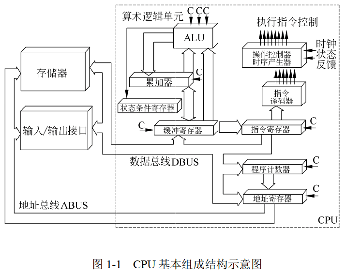

# 上午题 01 计算机系统

- [上午题 01 计算机系统](#上午题-01-计算机系统)
  - [01 CPU](#01-cpu)
    - [中央处理单元 CPU](#中央处理单元-cpu)
      - [CPU 功能](#cpu-功能)
      - [CPU 组成](#cpu-组成)
    - [运算器](#运算器)
      - [运算器主要功能](#运算器主要功能)
      - [运算器组成部件](#运算器组成部件)
    - [控制器](#控制器)
      - [控制器功能](#控制器功能)
      - [控制器组成部件](#控制器组成部件)
      - [指令控制逻辑](#指令控制逻辑)
  - [02 基本单位和进制转换](#02-基本单位和进制转换)
    - [计算机基本单位](#计算机基本单位)
    - [进制](#进制)
    - [进制转换](#进制转换)
    - [进制计算](#进制计算)
  - [03 原码、反码、补码、移码](#03-原码反码补码移码)
    - [原码](#原码)
    - [反码](#反码)
    - [补码](#补码)
    - [移码](#移码)
    - [定点数 表示范围](#定点数-表示范围)
  - [04 浮点数](#04-浮点数)
    - [规格化浮点数](#规格化浮点数)
  - [05 寻址](#05-寻址)
  - [06 校验码](#06-校验码)
    - [奇偶校验](#奇偶校验)
    - [海明码](#海明码)
    - [循环冗余校验码(CRC)](#循环冗余校验码crc)
  - [07 CISC 和 RISC](#07-cisc-和-risc)
  - [08 流水线](#08-流水线)
  - [09 存储器](#09-存储器)
  - [10 Cache](#10-cache)
  - [11 中断](#11-中断)
  - [12 输入输出（IO）控制方式](#12-输入输出io控制方式)
  - [13 总线](#13-总线)
  - [14 安全性](#14-安全性)
  - [15 加密算法](#15-加密算法)
  - [16 系统可靠度](#16-系统可靠度)

---

1. CPU：P2~P19
2. 基本单位和进制转换：P20~P35
3. 原、反、补、移码：P36~P45
4. 浮点数：P46~P56
5. 寻址：P57~P63
6. 校验码：P64~P76
7. CISC与RISC：P77~P83
8. 流水线：P84~P95
9. 存储器：P96~P105
10. Cache：P106~P118
11. 中断：P119~P126
12. 输入输出（IO）控制方式：P127~P141
13. 总线：P142~P151
14. 安全性：P152~P168
15. 加密算法：P169~P179
16. 可靠性：P180~P186
17. 杂题选讲：P187~P199
18. 计算机系统总结：P200

## 01 CPU

- 计算机系统
  - 软件 + 硬件 组成，协同工作来运行程序
  - 基本硬件系统
    - 5大部件组成：运算器 + 控制器 + 存储器 + 输入设备 + 输出设备
    - 存储器:
      - 计算机系统中的记忆设备
      - 内部存储器: 速度高、容量小，临时存放程序、数据及中间结果
      - 外部存储器：速度慢、容量大，长期保存程序和数据
    - 外部设备
      - 输入设备 + 输出设备 的合称，简称外设
      - 输入设备：输入原始数据及各种命令
      - 输出设备：输出计算机运行结果
    - 中央处理单元
      - 硬件系统的核心
      - 运算器 + 控制器 等部件的统称，简称 CPU (Central Processing Unit)
      - 数据的加工处理，完成算术/逻辑运算和控制功能

### 中央处理单元 CPU

计算机系统的核心部件，获取程序指令、对指令进行译码并加以执行。

#### CPU 功能

1. 程序控制：通过执行指令来控制程序的执行顺序，CPU的重要功能
2. 操作控制：产生指令的操作信号送往对应部件，控制其操作
3. 时间控制：对操作进行时间上的控制，操作信号出现时间、持续时间、出现的时间顺序
4. 数据处理：通过 算术/逻辑运算 对数据进行加工处理，CPU 最根本的任务

> 控制器：程序控制、操作控制、时间控制
> 运算器：数据处理

>5. 对系统内部的外部的中断(异常)作出响应，进行相应处理

#### CPU 组成

运算器、控制器、寄存器组、内部总线等部件组成



### 运算器

#### 运算器主要功能

1. 算术运算：基本运算(加、减、乘、除) + 附加运算
2. 逻辑运算(与、或、非) + 逻辑测试(零值测试、值比较)

#### 运算器组成部件

1. 算术逻辑单元 ALU
   - 运算器重要组成部件
   - 负责处理数据，实现对数据的算术运算和逻辑运算。
2. 累加寄存器 AC
   - 简称累加器
   - 通用寄存器
   - 为 ALU 提供一个工作区
   - 运算器中至少要有一个累加寄存器
3. 数据缓冲寄存器 DR
   - 作为CPU和内存、外部设备之间数据传送的中转站。
   - 作为CPU和内存、外围设备之间在操作速度上的缓冲。
   - 单累加器运算器中，兼作操作数寄存器
4. 状态条件寄存器 PSW
   - 保存由算数指令和逻辑指令运行或测试的结果建立的各种条件码内容。
   - 分为 状态标志 + 控制标志

### 控制器

#### 控制器功能

> 运算器只能完成运算
> 控制器控制整个 CPU 的工作，决定了计算机运行过程的自动化
> 不仅要保证程序的正确执行，而且要能够处理异常事件

- 指令控制逻辑
  - 操作：取指令、分析指令、执行指令
  - 过程：取指令、指令译码、按指令操作码执行、形成下一条指令地址
- 时序控制逻辑
- 总线控制逻辑
- 中断控制逻辑

#### 控制器组成部件

1. 指令寄存器（IR）
   - 暂存 CPU 正在执行的指令。
2. 程序计数器（PC）
   - 寄存信息 + 计数，也叫 指令计数器
   - 初始时保存程序第一条指令地址，执行指令时，CPU 自动修改 PC 内容，使其保持的总是将要执行的下一条指令的地址。
3. 地址寄存器（AR）
   - 保存当前 CPU 所访问的内存单元的地址。
4. 指令译码器（ID）
   - 对指令中的操作码字段进行分析解释，识别该指令规定的操作，向控制器发出信号，控制各部件工作，完成所需的功能。

#### 指令控制逻辑

> 指令 = 操作码 + 地址码
> 例如：1 + 2 中 1 和 2 为地址码， + 为操作码。

CPU 执行一条指令时，从 程序计数器 PC 读取地址，将指令从 内存储器 取到 缓冲寄存器 DR 中，再送入 指令寄存器 IR 暂存；同时将该地址保存到 地址寄存器 AR 中，然后修改 程序计数器 PC 内容，改为下一条指令的地址；指令译码器 ID 根据 指令寄存器 IR 的内容产生各种微操作指令，控制其他的组成部件工作，完成所需的功能。

## 02 基本单位和进制转换

### 计算机基本单位

| 中文名称 | 简写    | 说明                      |
| -------- | ------- | ------------------------- |
| 位(比特) | b(bit)  | 最小的数据单位            |
| 字节     | B(byte) | 最小的存储单位：1 B = 8 b |
| 千字节   | KB      | 1 KB = 1024 B             |
| 兆字节   | MB      | 1 MB = 1024 KB            |
| 吉字节   | GB      | 1 GB = 1024 MB            |
| 太字节   | TB      | 1 TB = 1024 GB            |

### 进制

- 十进制(D)：逢十进一 0~9
- 二进制(B)：逢二进一 0~1
- 八进制(O)：逢八进一 0~7
- 16进制(H)：逢16进一 0~9 A~F

### 进制转换

- N进制 -> 十进制
  - 按权展开求和
    > $X_1X_2...X_{i-1}X_i(N) = X_1 * N^{i-1} + X_2 * N^{i-2} + ... + X_{i-1} * N^1 + X_i * N^0 (D)$

- 十进制 -> N进制
  - 除 N 取余法

    ```txt
    除数N |_ 被除数 Y
     除数N |_ 商1 > 0 ... 余数 X1
      除数N |_ 商2 > 0 ... 余数 X2
       ...
        除数N |_ 商i-1 > 0 ... 余数 Xi-1
         除数N |_ 商i   = 0 ... 余数 Xi

    当商为 0 时停止，把余数从下往上写
    ```

    > $Y(D) = X_iX_{i-1}...X_2X_1(N)$

- 八进制 <-> 二进制
  - 1位八进制数 <-> 3位二进制数

- 16进制 <-> 二进制
  - 1位16进制数 <-> 4位二进制数

### 进制计算

- N进制加减法
  - 加法：逢N进1
  - 减法：借1当N

- 计算题做题思路
  - 容量(地址范围)
    - 大 减 小，再加 1
  - 转换(统一进制)
    - N进制 转 十进制，再根据题意转换单位进行计算

## 03 原码、反码、补码、移码

数值在计算机中的表示为机器数，特点是采用二进制来表示。

对于n位的机器数其表示编码有原码、反码、补码、移码等表示。

> 以下均假设 机器字节长 n=8

### 原码

- 最高位为符号位，0 表示正号，1 表示负号，其余的 n-1 位表示数值的绝对值。
- 0 有两种表示形式，正 0 为 0000_0000，负 0 为 1111_1111。

示例：
> $[+1]_原 = 0000\ 0001， [-1]_原 = 1000\ 0001$
>
> $[+0.5]_原 = 0.100\ 0000， [-0.5]_原 = 1.100\ 0000$

标准定义（了解）：
> 纯整数： $[X]_原 =
\begin{cases}
  X                   &0 \leq X \leq 2^{n-1}-1 \\
  2^{n-1} + |X| \quad &-(2^{n-1}-1) \leq X \leq 0
\end{cases}$
>
> 纯小数： $[X]_原 =
\begin{cases}
  X                &0 \leq X < 1 \\
  2^0 + |X| \qquad &-1 < X \leq 0
\end{cases}$

### 反码

- 最高位为符号位，0表示正号，1表示负号。
- 正数的反码与原码相同，负数的反码则是除符号位以外其余各位按位取反。
  （二进制取反即为0变成1，1变成0）
- 0 有两种表示形式，正 0 为 0000_0000，负 0 为 1111_1111。

示例：
> $[+1]_反 = 0000\ 0001， [-1]_反 = 1111\ 1110$
>
> $[+0.5]_反 = 0.100\ 0000， [-0.5]_反 = 1.011\ 1111$

标准定义（了解）：
> 纯整数： $[X]_反 =
\begin{cases}
  X                       &0 \leq X \leq 2^{n-1}-1 \\
  2^n - 1 + X \quad\qquad &-(2^{n-1}-1) \leq X \leq 0
\end{cases}$
>
> 纯小数： $[X]_反 =
\begin{cases}
  X                        &0 \leq X < 1 \\
  2 - 2^{-(n-1)} + X \quad &-1 \leq X < 0
\end{cases}$

### 补码

- 最高位为符号位，0表示正号，1表示负号。
- 正数的补码与原码、反码相同，负数的补码则是在其反码的基础上加1。
- 0 具有唯一编码，为 0000_0000(负0补码最高位溢出舍弃)。
- 补码的补码等于原码，即对补码再求一次补码等于其原码。

示例：
> $[+1]_补 = 0000\ 0001， [-1]_补 = 1111\ 1111$
>
> $[+0.5]_补 = 0.100\ 0000， [-0.5]_补 = 1.100\ 0000$

标准定义（了解）：
> 纯整数： $[X]_补 =
\begin{cases}
  X             &0 \leq X \leq 2^{n-1}-1 \\
  2^n + X \quad &-2^{n-1} \leq X \leq 0
\end{cases}$
>
> 纯小数： $[X]_补 =
\begin{cases}
  X           &0 \leq X < 1 \\
  2 + X \quad &-1 \leq X < 0
\end{cases}$

### 移码

- 不管正数和负数，移码是在其补码的基础上对符号位取反。
- 0 具有唯一编码，为 1000_0000。

示例：
> $[+1]_移 = 1000\ 0001， [-1]_移 = 0111\ 1111$
>
> $[+0.5]_移 = 1.100\ 0000， [-0.5]_移 = 0.100\ 0000$

标准定义（了解）：
> 移码是在数 X 上增加一个偏移量来定义的，常用于表示浮点数中的阶码。
>
> 设机器字长为 n，偏移量为 $2^{n-1}$：
>> 纯整数： $[X]_移 = 2^{n-1} + X \quad -2^{n-1} \leq X < 2^{n-1}$
>>
>> 纯小数： $[X]_移 = 1 + X \qquad -1 \leq X < 1$

### 定点数 表示范围

当机器字长为 n 时，定点数的补码和移码可表示 $2^n$ 个数（0 的表示有唯一的编码），原码和反码只能表示 $2^n-1$ 个数（0 的表示有 +0 和 -0 两个编码）

| 码制 |                        定点整数 |                              定点小数 |
| ---- | ------------------------------: | ------------------------------------: |
| 原码 | $-(2^{n-1}-1)$ ~ $+(2^{n-1}-1)$ | $-(1-2^{-(n-1)})$ ~ $+(1-2^{-(n-1)})$ |
| 反码 | $-(2^{n-1}-1)$ ~ $+(2^{n-1}-1)$ | $-(1-2^{-(n-1)})$ ~ $+(1-2^{-(n-1)})$ |
| 补码 | $-2^{n-1}$     ~ $+(2^{n-1}-1)$ | $-1$              ~ $+(1-2^{-(n-1)})$ |
| 移码 | $-2^{n-1}$     ~ $+(2^{n-1}-1)$ | $-1$              ~ $+(1-2^{-(n-1)})$ |

## 04 浮点数

定点数：小数点位置固定的数
浮点数：小数点位置不固定的数

二进制数更一般的表示形式：

$N = 2^E \times F \qquad E 为阶码，F 为尾数$

- 用阶码和尾数表示的数称为浮点数
- 这种表示数的方法称为浮点表示法
  - 阶码为带符号的纯整数，尾数为带符号的纯小数
- 浮点数表示格式：阶符|阶码|数符|尾数
  - 数值范围由阶码决定，数值精度由尾数决定

> 知识点：
>
> 浮点数加减法计算时，阶码不一致先对阶，小阶向大阶对齐，尾数右移

### 规格化浮点数

- 充分利用尾数来表示更多的有效数字
- 将尾数的绝对值限定在区间 [ 0.5, 1 ]

如果阶码(包括1位阶符)用R位的移码表示，尾数(包括1位数符)用M位的补码表示，则规格化浮点数范围如下：

- 最大的正数：$+(1-2^{-(M-1)}) \times 2^{(2^{R-1}-1)}$
- 最小的负数：$-1 \times 2^{(2^{R-1}-1)}$

## 05 寻址

按速度排序

- 立即寻址
  - 操作数就包含在指令中
- 寄存器寻址
  - 操作数存放在某一寄存器中
  - 指令中给出存放操作数的寄存器名
- 直接寻址
  - 操作数存放在内存单元中
  - 指令中直接给出操作数所在存储单元的地址
- 寄存器间接寻址
  - 操作数存放在内存单元中
  - 操作数所在存储单元的地址存放在某个寄存器中
  - 指令中给出存放地址的寄存器名
- 间接寻址
  - 操作数存放在内存单元中
  - 操作数所在存储单元的地址也存放在内存单元中
  - 指令中给出存放操作数地址的内存地址

其他方式

- 相对寻址
  - 指令地址码给出的是一个偏移量（可正可负）
  - 操作数地址等于本条指令的地址加上该偏移量
- 变址寻址
  - 操作数地址等于变址寄存器的内容加偏移量

## 06 校验码

码距：一个编码方案中任意两个合法编码之间至少有多少个二进制位不同

码距=2有检错能力，码距≥3才可能有纠错能力

也就是一个校验码要想能够检错和纠错那么它的码距至少是3

### 奇偶校验

码距为2，仅能检测出奇数位错误，不能纠错。

奇校验：增加一位校验码，使得编码中1的个数为奇数

偶校验：增加一位校验码，使得编码中1的个数为偶数

### 海明码

海明码利用多组数位的奇偶性来检错和纠错 可以检错和纠错 码距为3

数据位为 n 位，校验位为 k 位，则 n和k必须满足以下关系：$2^k-1>=n+k$

### 循环冗余校验码(CRC)

k个数据位后跟r个校验位 可以检错但不能纠错 码距为2 采用模2运算得到校验码

## 07 CISC 和 RISC

直接看下方表格知识点就好了，是按照题目内容编辑的表格，就是纯记概念就好。

| 特点             | RISC                             | CISC             |
| ---------------- | -------------------------------- | ---------------- |
| 中文             | 精简指令集计算机                 | 复杂指令集计算机 |
| 指令种类         | 少、精简                         | 多、丰富         |
| 指令复杂度       | 低（简单）                       | 高（复杂）       |
| 指令长度         | 固定                             | 变化             |
| 寻址方式         | 少                               | 复杂多样         |
| 实现（译码）方式 | 硬布线控制逻辑（组合逻辑控制器） | 微程序控制技术   |
| 通用寄存器数量   | 多、大量                         | 一般             |
| 流水线技术       | 支持                             | 不支持           |

## 08 流水线

加速比 = 不采用流水线的执行时间 / 采用流水线的执行时间

流水线的操作周期为长操作时间(最长流水段操作时间)

流水线的吞吐率是最长流水段操作时间的倒数。

顺序执行时间=一条指令执行的时间×总指令数

流水线执行时间=一条指令执行的时间+最长时间段×(总指令数-1)

连续输入n条指令的吞吐率=总指令数/总指令数执行的时间

## 09 存储器

知识点

- 按访问方式可分为按地址访问的存储器与按内容访问的存储器
  - 相联存储器是按内容访问的存储器
- 按寻址方式分类可分为随机存储器、顺序存储器和直接存储器
  - 虚拟存储器由主存与辅存组成

DRAM（动态随机存储器）构成主存 DRAM需要周期性地刷新保持信息

SRAM（静态随机存储器）构成Cache

闪存可以理解为U盘，故掉电后信息不会丢失。闪存是以块为单位进行删除的。闪存式EPROM的一种类型，可以代替ROM存储器。
> 闪存不能代替主存

## 10 Cache

- 直接映像：冲突多，关系固定
- 全相联映像：冲突少，关系不固定，主存中的一块可以映射到Cache中的任意一块，除非Cache满了才需要替换。
- 组相联影响：冲突较少，是直接映像与全相联映像的折中

哪个Cache与主存的地址映射记住：**由硬件自动完成**就完事啦~

## 11 中断

中断向量：中断服务程序的入口地址

中断向量表：汇集所有中断向量，为了提高响应中断的速度

中断响应时间：从发出中断请求到开始进入中断处理程序

保存现场：为了正确返回原程序继续执行

## 12 输入输出（IO）控制方式

- 程序查询方式
  - CPU 和 I/O（外设）只能串行工作
    - CPU 需要一直轮询检查，长期处于忙等状态。CPU利用率低
  - 一次只能读/写一个字
  - 由 CPU 将数放入内存
- 中断驱动方式
  - I/O 设备通过中断信号主动向 CPU 报告 I/O 操作已完成
  - CPU 和 I/O（外设）可并行工作
  - CPU 利用率得到提升
  - 一次只能读/写一个字
- 直接存储器存取方式(DMA)
  - CPU 和 I/O（外设）可并行工作
  - 仅在传送数据块的开始和结束时才需要 CPU 的干预
  - 由外设直接将数据放入内存
  - 一次读写的单位为“块”而不是字

## 13 总线

知识点又多又偏，不需要掌握，了解即可。

## 14 安全性

- 窃听 - 加密
- 篡改 - 摘要
- 假冒/否认 - 数字签名 - 数字证书

知识点

- 公钥体系也就是公开密钥加密也就是非对称加密
  - 非对称加密中，用接收方的公钥加密，用接收方的私钥解密
  - 用发送方的私钥签名（加密），用发送方的公钥验证（解密）

数字签名：

- 用发送方的私钥签名，用发送方的公钥验证消息的真实性
- 数字签名可以验证消息的真实性、发送方不可否认

数字证书：

- 用CA机构的私钥签名，用CA机构的私钥验证数字证书的真伪性
- 数字证书可以确认网站的合法性，用户的身份等

## 15 加密算法

加密算法这一块，直接背就好了，能够分清楚哪些算法属于哪一类算法就好。

对称密钥（私钥、私有密钥加密）算法：适合大量明文消息进行加密传输

- DES
- 3DES
- RC-5
- IDEA
- AES 分组加密算法
- RC4

非对称密钥（公钥、公开密钥加密）算法：

- RSA
- ECC
- DSA

Hash函数

- SHA-1 安全散列算法

信息摘要

- MD5摘要算法：
  - 对任意长度的输入计算得到的结果长度为128位。
  - 防止发送的报文被篡改

加密阻止被动攻击，认证阻止主动攻击

## 16 系统可靠度

就两个公式，大家区分串联和并联后套公式即可。

**串联系统**：

假设一个系统由N个子系统组成，当且仅当所有的子系统都能正常工作时，系统才能正常工作，这种系统称为串联系统。

设系统中各个子系统的可靠性分别用 R₁,R₂,...,Rɴ 表示，则整个系统的可靠性 R = R₁R₂...Rɴ

**并联系统**：

假如一个系统由N个子系统组成，只要有一个子系统正常工作，系统就能正常工作，这样的系统称为并联系统。

设系统中各个子系统的可靠性分别用 R₁,R₂,...,Rɴ 表示，则整个系统的可靠性 R = 1-(1-R₁)(1-R₂)...(1-Rɴ)
