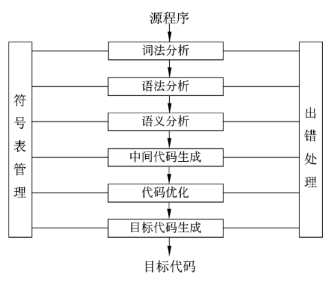

# 上午题 02 程序设计语言

<!-- TOC -->

- [上午题 02 程序设计语言](#上午题-02-程序设计语言)
  - [说明](#说明)
  - [编译程序和解释程序](#编译程序和解释程序)
  - [程序设计语言基本成分](#程序设计语言基本成分)
    - [数据](#数据)
    - [运算](#运算)
    - [控制](#控制)
    - [传输](#传输)
  - [传值调用和传地址调用](#传值调用和传地址调用)
    - [函数](#函数)
    - [参数调用](#参数调用)
  - [编译程序基本原理](#编译程序基本原理)
    - [词法分析](#词法分析)
      - [正规式](#正规式)
      - [有限自动机](#有限自动机)
    - [语法分析](#语法分析)
      - [上下文无关文法](#上下文无关文法)
      - [中缀、后缀表达式](#中缀后缀表达式)
      - [语法分析方法](#语法分析方法)
    - [语义分析](#语义分析)
    - [目标代码生成](#目标代码生成)
    - [中间代码生成](#中间代码生成)
    - [符号表](#符号表)
    - [动态语义错误](#动态语义错误)

<!-- /TOC -->

## 说明

- 分值：3-6 分
- 分布：
  - 20，21，22
  - 48，49，50

## 编译程序和解释程序

- 低级语言：面向机器的语言
  - 机器语言
  - 汇编语言
- 高级语言：面向各类应用的程序设计语言
  - C、C++、Java、Python、PHP等
- 源程序：高级语言或汇编语言编写的程序
  - 源程序不能直接在机器上运行
  - 需要“语言处理程序”进行“翻译”
- 语言处理程序
  - 汇编程序：
    - 将汇编语言编写的源程序翻译成目标程序
  - 解释程序 / 解释器：直接解释执行源程序，或将源程序翻译成某种中间代码后再加以执行
    - 翻译源程序时不生成独立的目标程序
    - 解释程序和源程序（或某种等价表示，如中间代码）要参与到程序的运行过程中
  - 编译程序 / 编译器：将源程序翻译成目标语言程序，在计算机上运行目标程序
    - 翻译时将源程序翻译成独立保存的目标程序
    - 机器上运行的是与源程序等价的目标程序，源程序和编译程序都不再参与目标程序的运行过程

## 程序设计语言基本成分

### 数据

数据类型的作用：

1. 便于为数据合理分配存储单元
2. 便于对参与表达式计算的数据对象进行检查
3. 便于规定数据对象的取值范围及能够进行的运算

常量和变量

- 常量不可以修改，没有分配存储单元
- 变量可以修改，有分配存储单元

### 运算

- 算术运算
- 关系运算
- 逻辑运算：与、或、非，短路运算
- 位运算

### 控制

三种基本控制结构：

- 顺序结构
- 选择结构
- 循环结构

### 传输

语言允许的数据传输方式，如：赋值处理、数据的输入和输出

## 传值调用和传地址调用

### 函数

函数 = 函数首部 + 函数体

函数定义的一般形式：

```c
返回值的类型 函数名(形式参数表) // 函数首部
{
	函数体
}
```

函数应该先声明后引用。

- 函数声明的一般形式：`返回值的类型 函数名(参数类型表);`
- 函数调用的一般形式：`函数名(实参表);`

### 参数调用

- 值调用 / 传值调用：Call by value
  - 将实参的值传递给形参，实参可以是 变量、常量、表达式
  - 不可以实现形参和实参间双向传递数据的效果
    - 形参不能向实参传递信息
- 引用调用：Call by Reference
  - 形参为引用类型时，将实参的地址传递给形参，实参不能是常量(值)、表达式
  - 可以实现形参和实参间双向传递数据的效果，即改变形参的值同时也改变了实参的值
    - 形参名称实际上是实参的别名，函数中对形参的访问和修改实际上是对相应实参所做的访问和改变

## 编译程序基本原理

编译方式：词法分析、语法分析、语义分析、中间代码生成、代码优化、目标代码生成

解释方式：词法分析、语法分析、语义分析

- 编译器和解释器都不可省略词法分析、语法分析、语义分析且顺序不可交换
- 编译方式中中间代码生成和代码优化不是必要，可省略。
  - 编译方式可以在词法分析、语法分析、语义分析阶段后直接生成目标代码

图：**编译器的工作阶段示意图**



### 词法分析

- 输入：源程序
- 输出：记号流
- 作用：分析构成程序的字符，及由字符按照构造规则构成的符号是否符合程序语言的规定

#### 正规式

词法分析工具

表：**正规式与正规集示例**

|   正规式   | 正规集                             |
| :--------: | ---------------------------------- |
|     ab     | 字符串 ab 构成的集合               |
|    a\|b    | 字符串 a、b 构成的集合             |
|     a*     | 由 0 个或多个 a 构成的字符串的集合 |
|  (a\|b)*   | 所有字符 a 和 b 构成的字符串的集合 |
|  a(a\|b)*  | 以 a 开头的 a、b 字符串的集合      |
| (a\|b)*abb | 以 abb 结尾的 a、b 字符串的集合    |

#### 有限自动机

词法分析的一个工具，它能正确地识别正规集

- 确定的有限自动机（DFA）：
  - 对每一个状态来说识别字符后只有一个转移状态，是唯一的
- 不确定的有限自动机（NFA）：
  - 对每一个状态来说识别字符后有一个以上的转移状态，是不确定的

### 语法分析

- 输入：记号流
- 输出：语法树（分析树）
- 作用：
  1. 对各条语句的结构进行合法性分析；
  2. 分析程序中的句子结构是否正确
  - 语法分析阶段可以发现程序中所有的语法错误

#### 上下文无关文法

- 2型文法
- 广泛的用于各种程序设计语言的语法规则

#### 中缀、后缀表达式

- 中缀式：a + b
- 后缀式（逆波兰式）：ab+
- 后缀式利用栈进行求值
- 语法树的后缀式为后序遍历、中缀式为中序遍历

#### 语法分析方法

- 自顶向下语法分析方法
  - 递归下降分析法
  - 预测分析法
- 自底向上语法分析方法
  - 移进—归约分析法
  - LR分析法

### 语义分析

- 输入：语法树（分析树）
- 作用：进行类型分析和检查
  - 语义分析阶段不能发现程序中所有的语义错误
    - 语义分析阶段可以发现静态语义错误
    - 不能发现动态语义错误，动态语义错误运行时才能发现

### 目标代码生成

- 目标代码生成阶段的工作与具体的机器密切相关
- 寄存器的分配工作处于目标代码生成阶段

### 中间代码生成

常见的中间代码有：后缀式、三地址码、三元式、四元式和树（图）等形式。

- 中间代码与具体的机器无关（不依赖具体的机器），可以将不同的高级程序语言翻译成同一种中间代码。
  - 中间代码可以跨平台。
- 因为与具体的机器无关，使用中间代码有利于进行与机器无关的优化处理和提高编译程序的可移植性。

### 符号表

不断收集、记录和使用源程序中一些相关符号的类型和特征等信息，并将其存入符号表中。

记录源程序中各个字符的必要信息，以辅助语义的正确性检查和代码生成。

### 动态语义错误

动态的语义错误，是在运行的时候才能检测出来。
